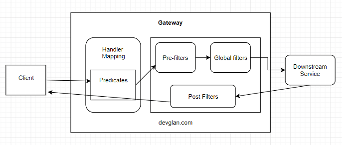
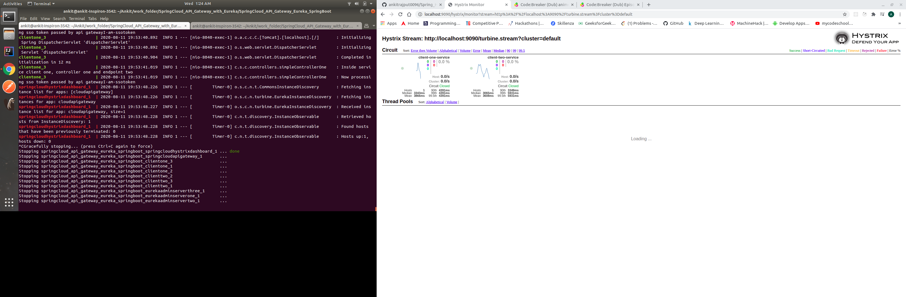

# Hystrix Turbine Dashboard for Spring Cloud API Gateway along with Eureka Cluster

Dockerized Spring Boot application of Hystrix Turbine Dashboard for Spring Cloud API Gateway along with Eureka Cluster.

## Getting Started

These instructions will get you a copy of the project up and running on your local machine for development purposes. See running for notes on how to run the project on a system.

### Prerequisites

1. Clone the project to your local environment:
    ```
    git clone https://github.com/ankitrajput0096/Spring_Hystrix_and_Dashboard
    ```

2. You need Docker to be installed:

    #### Windows:
    https://download.docker.com/win/stable/Docker%20for%20Windows%20Installer.exe
    
    #### Mac:
    https://download.docker.com/mac/stable/Docker.dmg
    
    #### Ubuntu:
    https://docs.docker.com/install/linux/docker-ce/ubuntu/

### Installing

Once you have docker installed on your environment, install the project dependencies via:

Build docker Image:

```
docker-compose build
```

## Running

Start docker:

```
docker-compose up
```
Or


Start docker with scaled up services:

```
docker-compose up --scale clientone=3 --scale clienttwo=3

```
### NOTE:
Can scale up clientone and clienttwo services to max instances of 5.
If you want to scale even higher, then increase the port range in `docker-compose` file.

Your Spring Cloud API Gateway server should be now running on http://localhost:8000, 
ClientOne server should be now running on http://localhost:8080-8085 and 
ClientTwo server should be now running on http://localhost:8086-90 and 
Eureka server cluster should be now running on http://localhost:9001, http://localhost:9002, http://localhost:9003, 
Hystrix dashboard should be now running on http://localhost:9090/hystrix and then enter this url => http://localhost:9090/turbine.stream?cluster=default
to see hystrix metrics for `Api-Gateway` service 

## Get access to all exposed API's with Postman

1. Install Postman (https://www.getpostman.com)
2. Import Postman collection from the `SpringCloud_API_Gateway_Eureka_SpringBoot.postman_collection.json` file
3. Enjoy !!

#### NOTE : To see changes in hystrix dashboard, try to hit different endpoints multiple times parallely. 

## Architecture design of Spring Cloud API Gateway

## Hystrix dashboard


## Built With

* [Spring Boot](https://spring.io/projects/spring-boot) - Spring Boot 2
* [Maven](https://maven.apache.org/) - Dependency Management
* [Docker](https://www.docker.com/) - For containerization of application
* [Spring Cloud Gateway](https://spring.io/projects/spring-cloud-gateway) - For API Gateway, Routing and Filtering using Spring Cloud Gateway
* [Eureka](https://spring.io/guides/gs/service-registration-and-discovery/) - For Eureka admin and client
* [Hystrix](https://cloud.spring.io/spring-cloud-netflix/multi/multi__circuit_breaker_hystrix_clients.html) - For Hystrix

## TODO 
Update the Spring boot version for `hystrix-dashboard` service. 

## Other Project
To see other way to use `hystrix` at service level. Check out the code in a folder : `spring-turbine`.
To run this project, just use `mvn clean install` and then `mvn spring-boot:run` for each service in it.

## Contributing

If you have any improvement suggestions please create a pull request, and I'll review it.

## Authors

* **Ankit Rajput** - *Initial work* - [Github](https://github.com/ankitrajput0096)

## License

This project is licensed under the MIT License

## Acknowledgments

* Big thanks to Pivotal for Spring Boot framework, love it!


